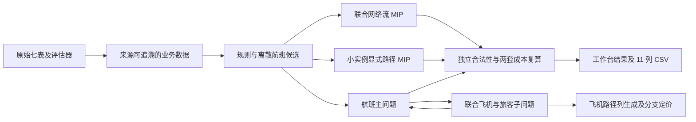

# 厦航业务扩展模型与求解接口

## 1. 原架构与接入判断

旧 HTML/React 工作台展示的是 Python 约束注册表及求解结果；公式入口在 `backend/core/constraint_registry.py`，实际联合模型在 `backend/core/integrated_oracle.py`。旧模型以 SRM 航班方案、ARM 飞机航班串、CRM 机组执勤串、PRM 不可拆分旅客行程组成联合模型。飞机/机组串覆盖执行方案，旅客行程只能使用执行方案，容量配置给定外生剩余座位。旧版调用合同及其研究案例继续走原编译器和求解服务。

| 内容 | 原模型 | 厦航模式 | 处理判断 |
|---|---|---|---|
| 数据与来源 | 标准 Scenario/候选列 | 七表、中文字段、北京时间、来源行 | 适配层转换，不改原 Excel |
| 飞机容量 | 外生旅客剩余容量 | 选定飞机物理座位 | 扩展联动模型 |
| 旅客 | 不可拆分 OD 群组 | 航段人数、联程、中转、整数拆分改签 | 扩展人数账本和模型，不能伪造 OD 群组 |
| 机组/维修 | 机组覆盖及维修代理约束 | 来源缺失 | 明确关闭 |
| 飞机终点 | 指定飞机终点 | 机型—机场全机队终点数量 | 新业务约束 |
| 机场 | 分别的起降容量/代理停机规则 | 起降共享容量、源码定义的跨场景停机 | 新业务规则 |
| 目标 | AIR 线性恢复成本 | 天池分段评分，或独立 AIR 线性研究成本 | 独立选择，分别复算 |

实现集中于 `backend/business/xma`。新增合同 `xma-1.0`、`xma-solve-1.0`、`xma-result-1.0`，与旧版 `1.0.0` 分派隔离。工作台保存完整业务输入、参数、目标标识和快照哈希。

## 2. 原数据与时间语义

原表 2364 航班、142 飞机、79 机场、4 机型、8693 禁飞记录、6 关闭记录、11 台风记录、8703 飞行时间记录、773 中转记录。飞行时间有 1464 个重复键行，有效查找按原源码后写覆盖；所有原始行仍保留。联程识别为原飞机相邻、同日期同航班号，共 616 对；48 航班超售，212 个原相邻过站不足 50 分钟。5 个同机场起降记录保留其来源含义，不自行解释为维修。

调整窗口包含两端：2017-05-06 06:00 至 2017-05-09 00:00。整体规划覆盖所有原航班及候选延误终点。窗口外航班冻结时间、飞机、取消和改签。国内延误上限 24 小时，国际 36 小时；配置的最大延误可以更小。

关闭日期为 `[effective, expiration)`，每日关闭时间与台风禁起降时间为严格开区间。容量窗包含两端，起降每 5 分钟合计不超过 2 次，两个容量窗都使用第一窗起点作为分桶原点。正常机场容量未提供，界面与模型不补造真实容量。

停机按原 `Scene.java`：两个相邻执行航班间的地面间隔完整覆盖停机场景才计入；没有前序或后续执行航班的初始/最终停车不计。多个场景同机场的计数累加并对每个限制检查，不能改成瞬时库存。

子集选择完整飞机轮转，实际数量可超过请求约数。外部进港中转航班保留原时间作为固定条件；出港到子集外的影响不进入子问题目标。子集 CSV 不能直接交给原全量工作簿评估，必须使用相同派生输入。

## 3. 共享联合数学模型

设 `O_f` 是航班候选含取消，`x_o∈{0,1}`。对每个原航班 `Σ(o∈O_f)x_o=1`。起降共享容量行 `Σ_o m_bo x_o≤C_b`。禁止航线—飞机组合不生成分配变量。

飞机分配 `u_ao∈{0,1}`，执行候选 `Σ_a u_ao=x_o`。同机型分配，冻结航班限定原飞机。每架飞机时间向前、地点连续，从原初始机场出发并执行至少一航段；终点数量 `Σ_a end_ak=original_terminal_count(type,airport)`。

### 直接网络流表示

机场时间事件间的地面弧和航班弧构成 DAG，各事件流守恒。每个航班落地使用独立状态，通常 50 分钟后释放到机场时间线。原相邻短过站采用 `min(50,original_turn)` 的独立直达衔接弧。联程两段都执行时，必须有直接进入指定下一航段的衔接弧，且分配同一飞机。直达弧不会流入共享机场事件，避免误连同一时间的其他航班。

停机通过已到达、未来出发、场景起点地面位置、场景内部无起飞四个整数条件精确表达；同机场多场景贡献累加。该网络规模不需要枚举所有飞机航班串。

### 旅客账本

中转按来源先判定进港取消，再判定选定出港起飞减进港到达是否达到最短中转时间。设每个出港航班取消进港人数 `tc_f`、失败进港人数 `tf_f`，联程搭档取消导致 `through_loss_f`。执行航班的账面人数

`N_f = passengers_f + through_f - tc_f - tf_f - through_loss_f`。

物理座位 `S_f = Σ_a,o seats_a u_ao`；溢出 `overflow_f=max(0,N_f-S_f)` 用有界整数线性化，原驻留旅客 `resident_f=N_f-overflow_f`。损失 `loss_f=tc_f+tf_f+overflow_f`，联程第一段再加其联程损失。取消航班损失为原普通旅客加第一段联程人数，按源码保留其取消账本处理顺序。冻结航班仅处理原超售，不允许送出改签。

`z_fg,o∈Z_+` 为从源航班到接收执行候选的改签人数。源在调整窗口内，目标同 OD、起飞不早于源原起飞；接收航班不能同时作为改签源。执行源只能改签失败进港和溢出人数；取消源还受源码普通旅客上限限制。`Σ_g z_fg≤loss_f`，未服务 `loss_f-Σ_g z_fg`。实际占座 `resident_g+Σ_f z_fg≤S_g`。不把“航段总人数”解释成独立旅客总数。

首版不支持跨机型、提前、调机、联程拉直；相关评分项为零。缺机组和维修数据时不编造计划。

## 4. 独立目标

### 天池 `tianchi_2017`

来源：附带 ZIP 中 `Configuration.java` 和 `ResultEvaluator.java`，合法性来自 `InputData.java` 及实体规则。默认优化天池成本；合法性是硬约束。评分器独立于求解变量复算。

| 项目 | 成本 |
|---|---|
| 取消航班 | 1200 × 重要系数 |
| 航班延误 | 100 × 延误小时 × 重要系数 |
| 同机型换飞机 | 原起飞≤2017-05-06 16:00 为15，之后为5，再乘重要系数 |
| 未服务旅客 | 4 × 按源码账本取消人数 |
| 驻留旅客延误 | 每人：0小时为0；(0,2] 为1；(2,4] 为1.5；(4,8] 为2；(8,36] 为3 |
| 改签旅客延误 | 每人延误小时 `h`：`h/30` 在[0,6)；`h/24` 在[6,24)；`h/18` 在[24,36)；`h/16` 在[36,48] |

超过源码旅客延误区间为 1e9。完整结果同时输出未启用项的零值。独立诊断非法方案使用 50,000,000 + 10×诊断违规数，违规计数粒度不保证等于 Java；非法方案的最终罚分以原 JAR 为准。

### AIR `air_linear_v1`

保留航班/飞机/旅客分模块线性成本配置，默认系数为航班延误 1/分钟、取消 25000、换飞机 0、旅客延误 10/人分钟、未服务 2500/人。所有参数可单独配置，天池常数不受其影响，机组成本为零。

该新模式把 AIR 成本作用于厦航航段账本，是独立研究版本，**不声称与旧 AIR 的不可拆分 OD 模型同一数学问题**。旧版 AIR 复现案例沿原合同运行。跨目标比较应同时看恢复指标和分别复算的两套成本。

## 5. 分解的有效性

SRM 主问题选 `x` 并含共享容量、联程冻结规则和 `θ≥0`。固定航班候选后，联合子问题同时优化飞机和旅客，保留物理座位联动。

Logic-based Benders 对已认证不可行的完整日程 `s` 使用 `Σ(o∈s)x_o≤|s|-1`。对已认证的子问题成本下界 `Q_L(s)≥0` 使用

`θ≥Q_L(s)[Σ(o∈s)x_o-|s|+1]`。

日程匹配时该割有效；其他日程右端≤0，由非负追索保证有效。`Q_L` 必须扣除主问题已计航班成本。未收敛子问题有认证下界可加条件下界割，有合法整数解可更新上界；无证明不添加不可行割。本实现条件割较弱，实际子集实验可能遍历很多日程，不能预先声称 Benders 更快。

联合子问题飞机路径列 `λ_ap≥0`，`Σ_p λ_ap=1`，`u_ao=Σ(p含o)λ_ap`；路径列还参与终点、联程邻接、停机行。人工变量 Phase I 包含所有限制行，完整定价后正人工目标才认证 LP 不可行。Phase II 关闭人工变量恢复业务目标。价格是固定日程 DAG 上精确最短路径，包括 `u`、终点、联程、停机对偶贡献；额外对偶经 `u` 联动行进入路径价格。无需全路径枚举。

分支优先飞机分配 `u`，随后其他剩余整数变量；每个节点重新建立受分支上下界限制的 RMP 并完整定价。路径列保持连续；整数 `u` 与正向时间路径、每机选一条路径确定整数业务分配，提取方案后仍执行独立审计。已认证 LP 给下界，审计通过的整数方案给上界。节点、定价、时间限制都保留终止原因，不把受限 RMP 目标当作全模型下界。

## 6. 求解器与规模约束

本机 Gurobi 13 可构建模型，但许可证受模型规模限制。仅当优化返回 Gurobi 10010 时，新厦航模式把同一个线性模型交给 SciPy/HiGHS，恢复 LP 对偶、整数上下界及目标常数。原 AIR 路线不修改。仍需 gurobipy 用于构模。

`max_assignment_options` 默认100000，是预先检查飞机—候选分配规模的保护值；不截断模型、不削减合法候选。全量、60分钟步长、最大延误120分钟产生361810个分配组合，会明确要求调整配置。用户可显式提高上限。所有最优性限于选定候选集合。

全局时间预算涵盖分解迭代，构模期间可能超出预算至构模返回；超时返回 `budget_exhausted_during_build`。HiGHS 无本实现的迭代事件/协作中断回调，隔离工作进程的强制停止仍有效。内存实验记录整个 Python 进程峰值 RSS，不是模型独占内存。

## 7. 接口

| 接口 | 功能 |
|---|---|
| POST `/api/v2/xma/import-preview?target_flights=20` | 请求体 `bundled` 或原xlsx字节；七表预览、问题、完整业务草稿 |
| POST `/api/v2/xma/precheck` | `XmaSolveRequest` 输入检查与候选/分配规模 |
| POST `/api/v2/xma/solve` | 同合同直接求解；长任务推荐工作台隔离运行 |
| POST `/api/v2/xma/evaluate` | `{request,decisions}` 独立业务评分 |
| POST `/api/v2/xma/export-csv` | `{request,decisions}` 生成11列无表头CSV |
| GET `/api/v2/xma/runs/{id}/csv` | 导出保存的完整 incumbent |

工作台复用草稿、编译、快照、运行、事件、恢复图与审计。目标和算法的切换进入内容哈希。实际运行限制另外记录在 `runtime_controls` 与 `effective_input_hash`，输入哈希保留原快照请求。

## 8. 验证与当前边界

测试涵盖真实七表、成本边界、四路线双目标一致、非零延误、溢出、整数拆分改签、真正发生分支的路径实例及节点限制、HiGHS LP/MIP一致、指定联程直达弧、预算与工作台完整生命周期。

103 航班派生工作簿对原 JAR 复算一致，详见 `docs/codex_reports/xma_jar_validation_20261008/baseline_verification.json`。另外在同一派生工作簿中明确添加两条合成中转关系，覆盖进港取消和转机失败，扩展验证的 Java/Python 分数均为 56870.37037037037，差值0，记录在 `verification.json`。合成关系说明在 `fixture_note.md`。这不是全量真实数据验证，也不能据此声明所有评分组合已由 JAR 覆盖。

当前实验完成了规模与收敛性记录，未获得全量恢复最优解。正式研究仍需更长时限、适当候选范围、候选加密敏感性及更强有效割/热启动，具体实验数据在带时间戳的报告中。
